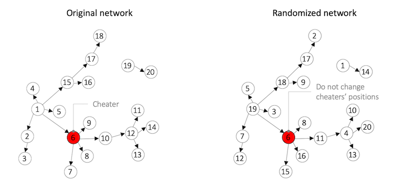

## Modelling cheating contagion

###  Description

- Analysis of social contagion of cheating on the massive multiplayer online game PlayerUnknown's Battlegrounds (PUBG).

- Hypothesis is that players who observe cheating become likely to adopt cheating themselves. To test this hypothesis, we follow three steps:

    - First, count how many observers of cheaters become cheaters within a certain period of time, called **observer–cheater motifs**. 
    - Second, simulate alternative universes in which the players played the same game but happened to be killed by someone else. 
    - Finally, compare how the count of the observer–cheater motifs observed in the actual data compares to what we would expect in a "randomized" world. 

#### Step 1. Identification of observers of cheating which start cheating

Cheating players can be recognized because they exhibit abnormal killing patterns. 

Player A realizes that cheating occurs if either:

1. cheating player B kills at least 3 other players before A gets killed in the game, or
2. A is killed by cheating player B.

How many players observed at least one cheater and then started cheating within the next 5 days?  

#### Step 2. Simulating an alternative universe

To establish causality, we will simulate an alternative world in which everything is the same but the events took somewhat different sequence. If observing cheating causes cheating, in the randomized world we will observe fewer observer–cheater motifs than in reality. To simulate an alternative universe, we will keep the timing and structure of interactions but randomly assign the identities of players. There are certain restrictions we need to observe, however: 

* Randomize within a game, not between games. 
* Since cheaters may tend to kill more or kill at a specific period in the game, we will preserve their position in the killing network. That is, only non-cheaters should be randomly reassigned. 

Shuffling is executed based on the following representation:

#### Step 3. Evaluating reality against alternative universes 

The evaluation of this alternative universes follow the next characteristics:

- Conduct 10 randomizations for the data. 

- Plotting of the number of observer–cheater motifs observed in the actual data compared to the distribution in the randomized data. 

A brief description of the results is included.

### Data

The dataset used contains the following files:

* `cheaters.txt` – contains cheaters who played between March 1 and March 10, 2019
    1. player account id
    * estimated date when the player started cheating
    * date when the player's account was banned due to cheating
    
* `kills.txt` – contains the killings done in 6,000 randomly selected matches played between March 1 and March 10, 2019
    1. match id 
    * account id of the killer
    * account id of the player who got killed
    * time when the attack (killing) happened

_Source: J. Kim_

### Modules

To tackle this task, three .py files were created: `get_data.py`, `cheat_contagion.py`, and `alt_universe.py`. The assumptions taken for each function are described within the files.

The main file with the code which executes these is `cheating_contagion.ipynb`.
